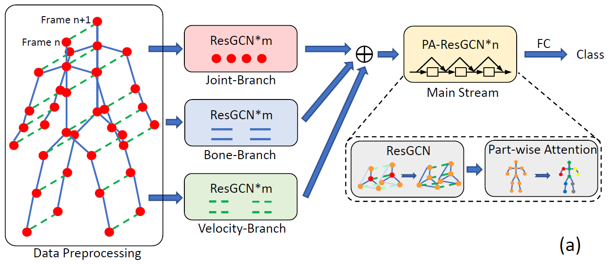
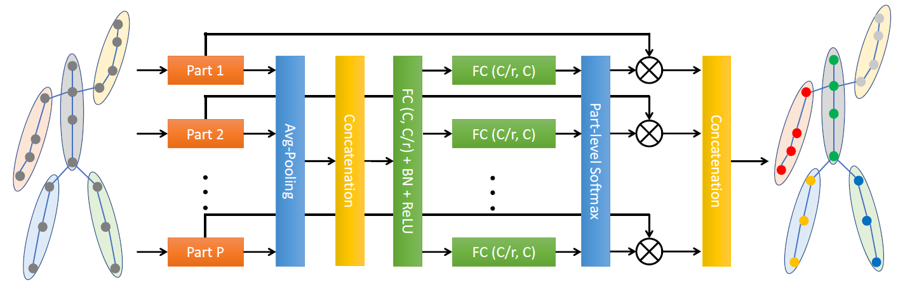

# Residual Graph Convolutional Network (ResGCN) v1.0

## 1 Paper Details

Yi-Fan Song, Zhang Zhang, Caifeng Shan and Liang Wang. **Stronger, Faster and More Explainable: A Graph Convolutional Baseline for Skeleton-based Action Recognition** ACM MultiMedia, 2020. [[ACMMM 2020]](https://dl.acm.org/doi/abs/10.1145/3394171.3413802) [[Arxiv Preprint]]()

The following pictures are the pipeline of ResGCNv1 and the illustration of PartAtt block, respectively.
<div align="center">
    
</div>

<div align="center">
    
</div>


## 2 Prerequisites

### 2.1 Libraries

This code is based on [Python3](https://www.anaconda.com/) (anaconda, >=3.5) and [PyTorch](http://pytorch.org/) (>=1.2.0).

Other Python libraries are presented in the **'scripts/requirements.txt'**, which can be installed by 
```
pip install -r scripts/requirements.txt
```

### 2.2 Experimental Dataset

Our models are experimented on the **NTU RGB+D 60 & 120** datasets, which can be download from 
[here](http://rose1.ntu.edu.sg/datasets/actionrecognition.asp).

There are 302 samples of **NTU RGB+D 60** and 532 samples of **NTU RGB+D 120** need to be ignored, which are shown in the **'src/preprocess/ignore.txt'**.

### 2.3 Pretrained Models

Several pretrained models are provided, which include **ResGCN-N51**, **PA-ResGCN-N51**, **ResGCN-B19**, and **PA-ResGCN-B19** for the **cross-subject (X-sub)** and **cross-view (X-view)** benchmarks of the **NTU RGB+D 60** dataset and the **cross-subject (X-sub120)** and **cross-setup (X-set120)** benchmarks of the **NTU RGB+D 120** dataset.

These models can be downloaded from [BaiduYun](https://pan.baidu.com/s/1iVZ2GfIhKNQq4YM3XZHiww) (Extraction code: **d3ea**) or [GoogleDrive](https://drive.google.com/drive/folders/1hb5fg1DMl_npwMIOn99RemscbAb1B3MM?usp=sharing).


## 3 Parameters

Before training and evaluating, there are some parameters should be noticed.

* (1) **'--config'** or **'-c'**: The config of RA-GCN. You must use this parameter in the command line or the program will output an error. There are 8 configs given in the **configs** folder, which can be illustrated in the following tabel.

| config    | 1001   | 1002   | 1003    | 1004    | 1005   | 1006   | 1007    | 1008    |
| :-------: | :----: | :----: | :-----: | :-----: | :----: | :----: | :-----: | :-----: |
| model     | N51    | N51    | N51     | N51     | B19    | B19    | B19     | B19     |
| benchmark | Xsub   | Xview  | Xsub120 | Xset120 | Xsub   | Xview  | Xsub120 | Xset120 |

| config    | 1009   | 1010   | 1011    | 1012    | 1013   | 1014   | 1015    | 1016    |
| :-------: | :----: | :----: | :-----: | :-----: | :----: | :----: | :-----: | :-----: |
| model     | PA-N51 | PA-N51 | PA-N51  | PA-N51  | PA-B19 | PA-B19 | PA-B19  | PA-B19  |
| benchmark | Xsub   | Xview  | Xsub120 | Xset120 | Xsub   | Xview  | Xsub120 | Xset120 |

* (2) **'--work_dir'** or **'-w'**: The path to workdir, for saving checkpoints and other running files. Default is **'./workdir'** in all config files.

* (3) **'--pretrained_path'** or **'-pp'**: The path to the downloaded pretrained models. Default is **'./pretrained'** in all config files.

* (4) **'--resume'** or **'-r'**: Resume from the recent checkpoint (**'<--work_dir>/checkpoint.pth.tar'**).

* (5) **'--evaluate'** or **'-e'**: Only evaluate models. You can choose the evaluating model according to the instructions.

* (6) **'--extract'** or **'-ex'**: Extract features from a trained model for visualization. Using this parameter will make a data file named **'extraction_<--config>.npz'** at the **'./visualization'** folder.

* (7) **'--visualization'** or **'-v'**: Show the information and details of a trained model. You should extract features by using **<--extract>** parameter before visualizing.

* (8) **'--dataset'** or **'-d'**: Choose the dataset. (Choice: **[ntu-xsub, ntu-xview, ntu-xsub120, ntu-xset120]**)

* (9) **'--model_type'** or **'-mt'**: Choose the model. (Format: **{attention}-resgcn-{structure}-{reduction}**, attention: **[pa, ca, fa, sa, pca, psa]**, structure: **[b15, b19, b23, b29, n39, n51, n57, n75]**, reduction: **[r1, r2, r4, r8]**)

Other parameters can be updated by modifying the corresponding config file in the **'configs'** folder or using command line to send parameters to the model, and the parameter priority is **command line > yaml config > default value**.


## 4 Running

### 4.1 Modify Configs

Firstly, you should modify the **'path'** parameters in all config files of the **'configs'** folder.

A python file **'scripts/modify_configs.py'** will help you to do this. You need only to change three parameters in this file to your path to NTU datasets.
```
python scripts/modify_configs.py --path <path/to/save/preprocessed/data> --ntu60_path <path/to/ntu60/dataset> --ntu120_path <path/to/ntu120/dataset>
```

### 4.2 Generate Datasets

After modifing the path to datasets, please generate preprocessed datasets by using **'scripts/auto_gen_data.sh'**.
```
bash scripts/auto_gen_data.sh
```

Or you can preprocess data (same as [2s-AGCN](https://github.com/lshiwjx/2s-AGCN)) by the following command (only the first time to use this benchmark). It may take you several hours. 
```
python main.py -c <config> -gd
```
where `<config>` is the config file name in the **'configs'** folder, e.g., 1001.

**Note:** only training the NTU X-view benchmark with the PA-ResGCN-N51 (config: 1010) and PA-ResGCN-B19 (config: 1014) models requires this preprocessed data.

### 4.3 Train

You can simply train the model by 
```
python main.py -c <config>
```
If you want to restart training from the saved checkpoint last time, you can run
```
python main.py -c <config> -r
```

### 4.4 Evaluate

Before evaluating, you should ensure that the trained model corresponding the config is already saved in the **'<--work_dir>'** folder. Then run
```
python main.py -c <config> -e
```

### 4.5 Visualization

To visualize the details of the trained model, you can run
```
python main.py -c <config> -ex -v
```
where **'-ex'** can be removed if the data file **'extraction_`<config>`.npz'** already exists in the **'./visualization'** folder.


## 5 Results

Top-1 Accuracy for the provided models on **NTU RGB+D 60 & 120** datasets.

| models        | NTU Xsub  | NTU Xview | NTU Xsub120 | NTU Xset120 |
| :-----------: | :-------: | :-------: | :---------: | :---------: |
| ResGCN-N51    | 89.1%     | 93.5%     | 84.0%       | 84.2%       |
| ResGCN-B19    | 90.3%     | 95.6%     | 86.6%       | 87.1%       |
| PA-ResGCN-N51 | 90.0%     | 94.8%     | 85.2%       | 85.7%       |
| PA-ResGCN-B19 | **90.9%** | **96.0%** | **87.3%**   | **88.3%**   |

## 6 Citation and Contact

If you have any question, please send e-mail to `yifan.song@cripac.ia.ac.cn`.

Please cite our paper when you use this code in your reseach.
```
@inproceedings{song2020stronger,
  author    = {Song, Yi-Fan and Zhang, Zhang and Shan, Caifeng and Wang, Liang},
  title     = {Stronger, Faster and More Explainable: A Graph Convolutional Baseline for Skeleton-Based Action Recognition},
  booktitle = {Proceedings of the 28th ACM International Conference on Multimedia (ACMMM)},
  pages     = {1625–1633},
  year      = {2020},
  isbn      = {9781450379885},
  publisher = {Association for Computing Machinery},
  address   = {New York, NY, USA},
  url       = {https://doi.org/10.1145/3394171.3413802},
  doi       = {10.1145/3394171.3413802},
}
```
